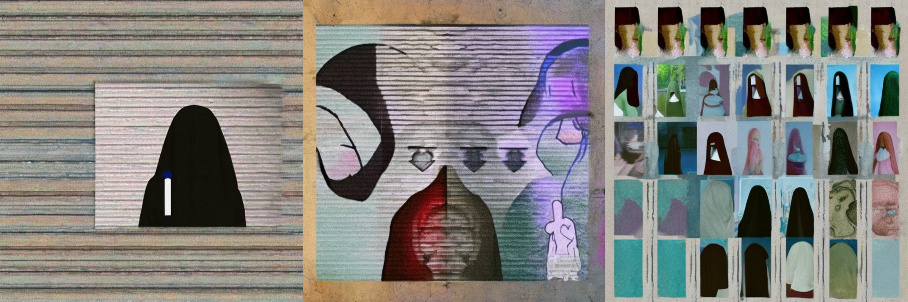
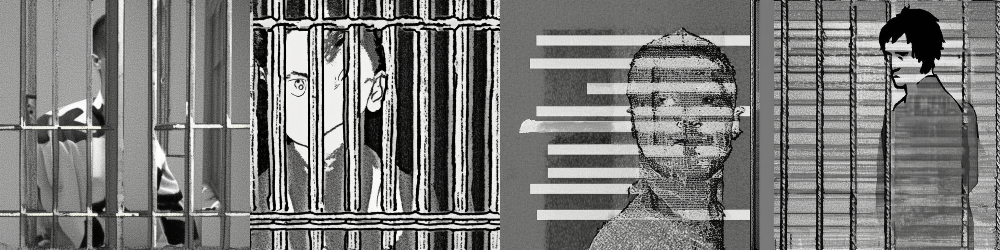
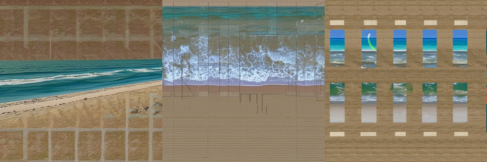

# GhstCllgs – Fine-Tuning Stable Diffusion via DreamBooth

**GhstCllgs** is an artistic experiment in fine-tuning *Stable Diffusion* on a personal visual style using the **DreamBooth** technique. Built in Python and trained using a custom dataset of original collage-style works, the project explores how generative AI can learn from and contribute to an artist’s creative process.


## **Overview**

- Trains a custom text-to-image diffusion model using only ~50 images.
- Applies the *DreamBooth* fine-tuning method on `stabilityai/stable-diffusion-xl-base-1.0`.
- All training is performed on Google Colab with GPU acceleration.
- Final model outputs are analysed for style retention (texture, colour, composition).


## **Installation**

1. Clone the repository:
```bash
git clone https://github.com/your-username/ghstcllgs.git
```

2. Install dependencies

> A full Google Colab notebook is included in the repo (`dreambooth_project.ipynb`).


## **Usage**

### **Training**
To train your own model:
- Replace the dataset path in the notebook.
- Set your desired `instance_prompt` string.
- Run the notebook in Google Colab.

Checkpoints are saved to Google Drive or your Hugging Face Hub.

### **Inference**
After training, generate new images with your model using:
```python
pipe(prompt="your prompt in the style of ghstcllgs")
```


## **Sample Outputs**

Below are some outputs generated using the fine-tuned `ghstcllgs03` model:

### `"faceless"`


### `"in the style of ghstcllgs"`


### `"prisoner"`


### `"the beach in sections"`



## **Model Checkpoint**

The fine-tuned model is hosted on Hugging Face:
👉 [GhstCllgs03 on Hugging Face](https://huggingface.co/ina-hre/ghst-cllgs03)


## **Sources & Acknowledgements**

Key references:
- [DreamBooth Training Guide (Hugging Face)](https://huggingface.co/blog/dreambooth)
- [Diffusers Library Docs](https://huggingface.co/docs/diffusers/en/index)
- [Source Notebook](https://colab.research.google.com/drive/1muBY-yFCu_jAxnxeNW0RGwwNQhWQsE24)


## **Disclaimer**

This project used Google Colab and Hugging Face’s Diffusers library. All data used for fine-tuning was original artwork. Some guidance was provided by LLM tools during debugging and setup stages.

